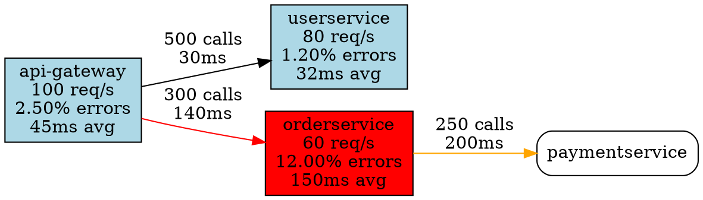

# Service Dependency Mapping

Automatic discovery and visualization of service-to-service dependencies from distributed traces.

## Overview

The dependency mapper analyzes traces to build a real-time map of your microservices architecture:

- **Auto-discovery**: No manual configuration needed
- **Real-time updates**: Refreshes from recent traces
- **Circular dependency detection**: Finds architectural problems
- **Performance insights**: Latency and error rates per dependency
- **Multiple export formats**: DOT (Graphviz), JSON, API

## How It Works

```
Traces → Correlation Analysis → Dependency Graph → Visualization
           (workflows)           (services+edges)    (DOT/JSON/API)
```

The mapper examines workflows (traces with same `correlation_id`) and identifies when Service A calls Service B by looking at consecutive actions in the workflow.

## Quick Start

### 1. Initialize Dependency Mapper

```go
import (
	"context"
	"eve.evalgo.org/tracing"
)

// Create mapper
mapper := tracing.NewDependencyMapper(db)

// Build graph from last 24 hours of traces
ctx := context.Background()
if err := mapper.BuildGraphFromTraces(ctx, 24); err != nil {
	log.Fatal(err)
}
```

### 2. Query Dependencies

```go
// Get all dependencies for a service
deps := mapper.GetDependencies("containerservice")
for _, dep := range deps {
	fmt.Printf("%s calls %s (%d times, %.0fms avg)\n",
		dep.FromService, dep.ToService, dep.CallCount, dep.AvgLatencyMs)
}

// Get all services that depend on this service
dependents := mapper.GetDependents("s3service")
for _, dep := range dependents {
	fmt.Printf("%s depends on s3service\n", dep.FromService)
}
```

### 3. Detect Circular Dependencies

```go
cycles := mapper.DetectCircularDependencies()
if len(cycles) > 0 {
	log.Warn("Circular dependencies detected!")
	for _, cycle := range cycles {
		fmt.Printf("Cycle: %v\n", cycle.Cycle)
	}
}
```

### 4. Export Visualizations

```go
// Export to Graphviz DOT format
dot := mapper.ExportToDOT()
os.WriteFile("dependencies.dot", []byte(dot), 0644)

// Convert to PNG with Graphviz
// dot -Tpng dependencies.dot -o dependencies.png

// Export to JSON
jsonData, _ := mapper.ExportToJSON()
os.WriteFile("dependencies.json", []byte(jsonData), 0644)
```

## API Reference

### DependencyMapper

#### Methods

**BuildGraphFromTraces(ctx, hours)**
```go
func (dm *DependencyMapper) BuildGraphFromTraces(ctx context.Context, hours int) error
```
Builds dependency graph from traces in the last N hours.

**GetGraph()**
```go
func (dm *DependencyMapper) GetGraph() *DependencyGraph
```
Returns a copy of the entire dependency graph.

**GetService(serviceID)**
```go
func (dm *DependencyMapper) GetService(serviceID string) (*ServiceNode, bool)
```
Returns service node information (request count, error rate, latency).

**GetDependencies(serviceID)**
```go
func (dm *DependencyMapper) GetDependencies(serviceID string) []*DependencyEdge
```
Returns all services that this service depends on (outgoing calls).

**GetDependents(serviceID)**
```go
func (dm *DependencyMapper) GetDependents(serviceID string) []*DependencyEdge
```
Returns all services that depend on this service (incoming calls).

**DetectCircularDependencies()**
```go
func (dm *DependencyMapper) DetectCircularDependencies() []CircularDependency
```
Detects circular dependency cycles using depth-first search.

**ExportToDOT()**
```go
func (dm *DependencyMapper) ExportToDOT() string
```
Exports graph to Graphviz DOT format for visualization.

**ExportToJSON()**
```go
func (dm *DependencyMapper) ExportToJSON() (string, error)
```
Exports graph to JSON format.

**GetMetrics()**
```go
func (dm *DependencyMapper) GetMetrics() map[string]interface{}
```
Returns graph statistics (service count, dependency count, cycles).

### Data Structures

**ServiceNode**
```go
type ServiceNode struct {
	ServiceID     string
	ActionTypes   []string  // Actions this service performs
	ObjectTypes   []string  // Objects this service handles
	RequestCount  int64     // Total requests
	ErrorCount    int64     // Total errors
	AvgLatencyMs  float64   // Average latency
	LastSeen      time.Time
}
```

**DependencyEdge**
```go
type DependencyEdge struct {
	FromService  string
	ToService    string
	CallCount    int64     // Number of calls
	ErrorCount   int64     // Errors in calls
	AvgLatencyMs float64   // Average call latency
	ActionTypes  []string  // Actions used in calls
	LastSeen     time.Time
}
```

**CircularDependency**
```go
type CircularDependency struct {
	Cycle    []string  // Service IDs in cycle
	Detected time.Time
}
```

## Usage Examples

### Example 1: Refresh Dependency Graph Periodically

```go
// Run in background goroutine
go func() {
	ticker := time.NewTicker(1 * time.Hour)
	defer ticker.Stop()

	for range ticker.C {
		ctx := context.Background()
		if err := mapper.BuildGraphFromTraces(ctx, 24); err != nil {
			log.Errorf("Failed to refresh dependency graph: %v", err)
			continue
		}

		// Check for circular dependencies
		if cycles := mapper.DetectCircularDependencies(); len(cycles) > 0 {
			log.Warnf("Circular dependencies detected: %d cycles", len(cycles))
			// Alert the team
		}

		log.Info("Dependency graph refreshed")
	}
}()
```

### Example 2: Identify Bottleneck Services

```go
graph := mapper.GetGraph()

// Find services with high error rates
for serviceID, service := range graph.services {
	errorRate := float64(service.ErrorCount) / float64(service.RequestCount) * 100

	if errorRate > 5.0 {
		fmt.Printf("⚠️  %s has %.2f%% error rate\n", serviceID, errorRate)
	}

	if service.AvgLatencyMs > 1000 {
		fmt.Printf("🐌 %s is slow: %.0fms average latency\n", serviceID, service.AvgLatencyMs)
	}
}
```

### Example 3: Find Critical Services

```go
// Critical service = many other services depend on it
graph := mapper.GetGraph()

for serviceID := range graph.services {
	dependents := mapper.GetDependents(serviceID)

	if len(dependents) >= 5 {
		fmt.Printf("🔥 Critical service: %s (%d dependents)\n", serviceID, len(dependents))

		// List dependents
		for _, dep := range dependents {
			fmt.Printf("  - %s\n", dep.FromService)
		}
	}
}
```

### Example 4: Generate Architecture Diagram

```go
// Export to DOT
dot := mapper.ExportToDOT()
os.WriteFile("architecture.dot", []byte(dot), 0644)

// Generate PNG with Graphviz
cmd := exec.Command("dot", "-Tpng", "architecture.dot", "-o", "architecture.png")
if err := cmd.Run(); err != nil {
	log.Errorf("Failed to generate PNG: %v", err)
}

// Generate SVG (better for web)
cmd = exec.Command("dot", "-Tsvg", "architecture.dot", "-o", "architecture.svg")
if err := cmd.Run(); err != nil {
	log.Errorf("Failed to generate SVG: %v", err)
}
```

### Example 5: REST API Endpoint

```go
// Add to your service
e.GET("/v1/api/dependencies", func(c echo.Context) error {
	serviceID := c.QueryParam("service_id")

	if serviceID != "" {
		// Get dependencies for specific service
		deps := mapper.GetDependencies(serviceID)
		return c.JSON(200, map[string]interface{}{
			"service_id":   serviceID,
			"dependencies": deps,
		})
	}

	// Return full graph
	graph := mapper.GetGraph()
	return c.JSON(200, graph)
})

e.GET("/v1/api/dependencies/dot", func(c echo.Context) error {
	dot := mapper.ExportToDOT()
	return c.String(200, dot)
})

e.GET("/v1/api/dependencies/cycles", func(c echo.Context) error {
	cycles := mapper.DetectCircularDependencies()
	return c.JSON(200, map[string]interface{}{
		"cycles": cycles,
		"count":  len(cycles),
	})
})
```

## Visualization

### Graphviz DOT Output

The `ExportToDOT()` method generates Graphviz diagrams with:

**Node coloring**:
- 🟦 Light blue: Healthy service (<5% errors)
- 🟧 Orange: Warning (5-10% errors)
- 🟥 Red: Critical (>10% errors)

**Node labels** show:
- Service name
- Request rate (req/s)
- Error percentage
- Average latency

**Edge coloring**:
- ⚫ Black: Healthy dependency
- 🟧 Orange: Warning (5-10% errors)
- 🟥 Red: Critical (>10% errors)

**Edge labels** show:
- Call count
- Average latency

### Example DOT Output



### Convert to Images

```bash
# PNG
dot -Tpng dependencies.dot -o dependencies.png

# SVG (better for web)
dot -Tsvg dependencies.dot -o dependencies.svg

# PDF (for documentation)
dot -Tpdf dependencies.dot -o dependencies.pdf
```

## Circular Dependency Detection

Circular dependencies are problematic because:
- **Cascading failures**: If Service A fails, B fails, which causes A to fail again
- **Deadlocks**: Services waiting on each other
- **Deployment complexity**: Can't deploy independently
- **Testing difficulty**: Hard to isolate services

### Detection Algorithm

Uses depth-first search (DFS) with recursion stack to detect cycles:

```
1. Start from each unvisited service
2. Mark service as visited and add to recursion stack
3. Recursively visit all dependencies
4. If we encounter a service already in recursion stack → cycle found
5. Extract cycle path from recursion stack
```

### Example Cycles

**Simple cycle (2 services)**:
```
Service A → Service B → Service A
```

**Complex cycle (4 services)**:
```
Service A → Service B → Service C → Service D → Service A
```

### Handling Cycles

If cycles are detected:

1. **Review architecture**: Are both directions actually needed?
2. **Introduce async messaging**: Break synchronous dependency with message queue
3. **Add abstraction layer**: Insert intermediate service or API gateway
4. **Refactor**: Combine cyclic services or extract shared logic

## Integration with MCP

When-MCP tools can be added to query dependencies:

```typescript
// MCP tool: when_get_service_dependencies
{
  "name": "when_get_service_dependencies",
  "description": "Get all dependencies for a service",
  "parameters": {
    "service_id": "containerservice"
  }
}

// MCP tool: when_detect_circular_dependencies
{
  "name": "when_detect_circular_dependencies",
  "description": "Detect circular dependencies in architecture"
}

// MCP tool: when_get_dependency_graph
{
  "name": "when_get_dependency_graph",
  "description": "Get full dependency graph in JSON format"
}
```

## Monitoring Dependencies

### Prometheus Metrics

Add metrics for dependency health:

```go
// In metrics.go
DependencyCallsTotal: promauto.NewCounterVec(
	prometheus.CounterOpts{
		Name: "dependency_calls_total",
		Help: "Total calls between services",
	},
	[]string{"from_service", "to_service", "status"},
)

DependencyLatency: promauto.NewHistogramVec(
	prometheus.HistogramOpts{
		Name: "dependency_latency_seconds",
		Help: "Latency of service-to-service calls",
	},
	[]string{"from_service", "to_service"},
)
```

### Grafana Dashboard Panel

```yaml
- title: "Service Dependency Map"
  type: "nodeGraph"
  datasource: "Prometheus"
  targets:
    - expr: |
        sum(rate(dependency_calls_total[5m])) by (from_service, to_service)
```

## Best Practices

### DO

1. **Refresh regularly**: Update graph every 1-6 hours
2. **Monitor for cycles**: Alert when circular dependencies appear
3. **Track critical services**: Know which services have many dependents
4. **Export diagrams**: Include in documentation and architecture reviews
5. **Analyze before deployments**: Check dependency impact

### DON'T

1. **Don't rely on stale data**: Refresh graph regularly
2. **Don't ignore circular dependencies**: They will cause problems
3. **Don't create deep chains**: Limit to 3-4 hops max
4. **Don't couple unrelated services**: Keep dependencies minimal
5. **Don't forget async patterns**: Not all service interactions need to be synchronous

## Troubleshooting

### Empty Dependency Graph

**Problem**: No dependencies discovered

**Solution**:
1. Check traces exist in database
2. Verify traces have `correlation_id`
3. Ensure multiple services are involved in workflows
4. Check time range (increase hours parameter)

### Missing Dependencies

**Problem**: Known dependencies not showing in graph

**Solution**:
1. Verify both services are writing traces
2. Check both services are using same `correlation_id` for workflows
3. Ensure traces are consecutive in workflow (step numbers)

### Too Many Dependencies

**Problem**: Graph shows unexpected dependencies

**Solution**:
1. Review trace data - might be discovering real but unintended dependencies
2. Check for shared resources (message queues, databases)
3. Filter by time range to focus on active dependencies

## Related Documentation

- Tracing System: `/home/opunix/eve/tracing/`
- MCP Tools: `/home/opunix/when` (when-mcp)
- Grafana Dashboards: `/home/opunix/eve/grafana/dashboards/`
- Metrics: `/home/opunix/eve/tracing/metrics.go`
